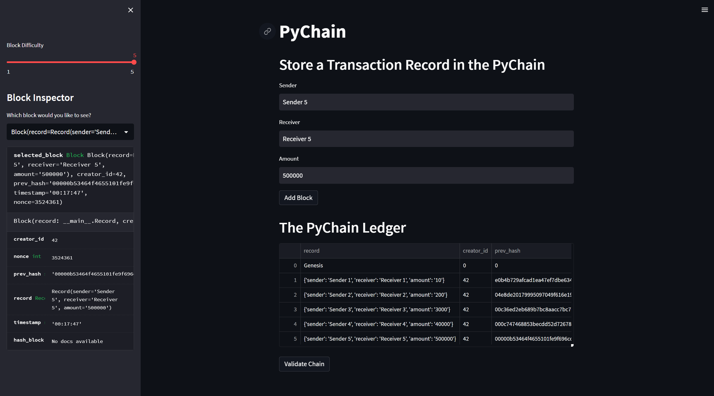
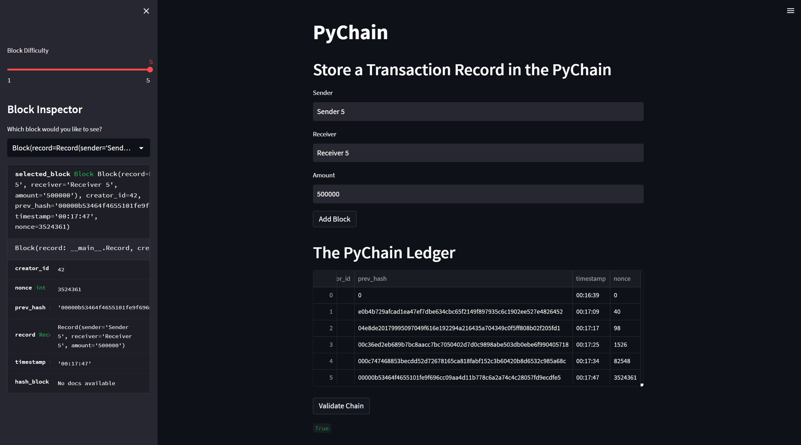

# blockchain-homework
Module 18 Challenge: PyChain Ledger

## Application description
This Streamlit-based application allows users to conduct financial transactions on a blockchain-based ledger system, and verify the integrity of the transactional data in the ledger.

### Data entry

---

  
Users begin their financial transaction by selecting the block difficulty level in the left-hand sidebar using the `Block Difficulty` slider. On the main page, users then enter the following information in the appropriate input fields:
- Sender address (`Sender`)
- Receiver address (`Receiver`)
- Amount to send (`Amount`)

To submit the transaction, users click the `Add Block` button. Upon clicking the button, the data pertaining to the transaction is displayed in a new row at the bottom of the PyChain ledger table below the button.

### Data verification

---

  
To verify the integrity of the ledger data, users only need to click the `Validate Chain` button below the PyChain ledger table. Upon clicking the button, a `True` or `False` statement will appear directly below, indicating the validity of the ledger data.

## Other information
- All work for the application can be found in the [pychain.py](https://github.com/julianritchey/blockchain-homework/blob/main/pychain.py) file.